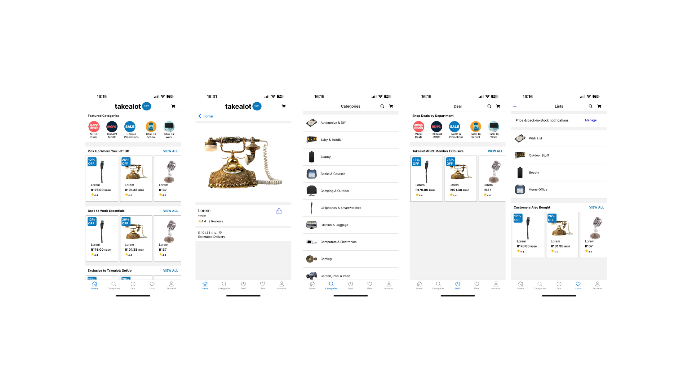

# Takealot Mobile App Clone
Welcome to my Takealot mobile app clone, a front-end application built using React Native, Expo, and Javascript.

## Getting Started
To run this application, you will need to have Node.js, Expo CLI, and a mobile device or emulator installed on your computer. You will also need to have a basic understanding of React Native and Javascript.

### Installing
1. Clone the repository to your local machine:
```sh
git clone https://github.com/alusru/takealot-react-native-clone.git
```
2. Install the necessary dependencies:
```sh
npm install
```
3. Run the following command to start the application:
```sh
npm run start
```
This will start the Expo development server and provide you with a QR code to scan with your mobile device. You can also run the app on an emulator by selecting the appropriate option in the Expo interface.



